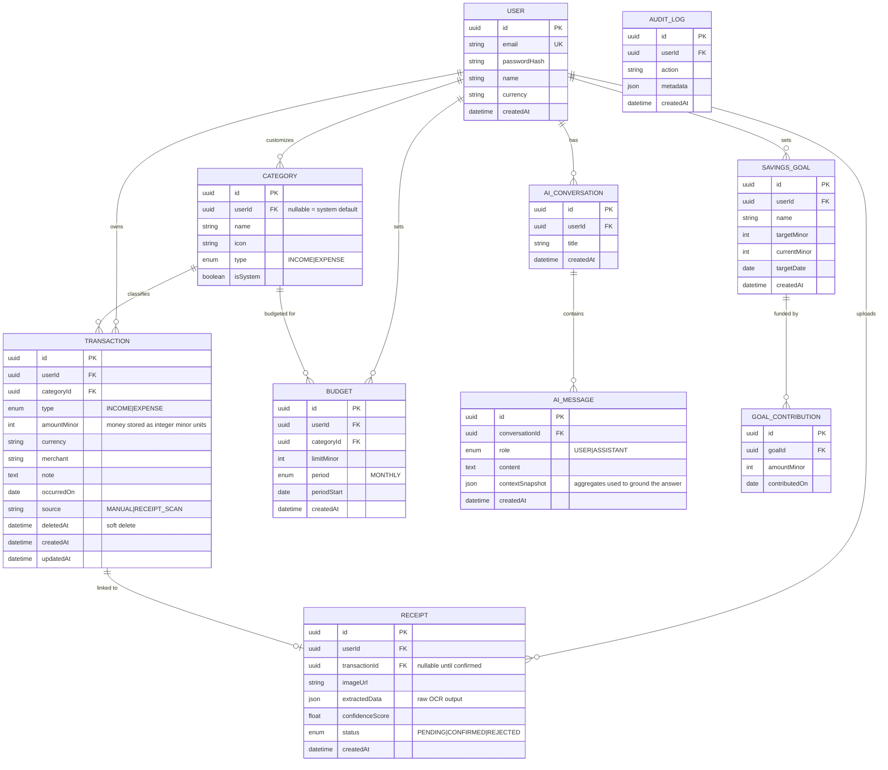

# FinPilot AI — Architecture & Planning Document
### "Your intelligent financial copilot."

**Status:** Phase 0 — Design sign-off, before implementation begins.
**Author:** Staff Engineer / Principal AI Engineer design pass.

This document is the single source of truth for how FinPilot AI is built. Nothing in the modules below gets implemented until this plan is reviewed and confirmed section-by-section (or as a whole). It intentionally reads like an internal design doc (RFC-style), because that's the artifact that actually differentiates a portfolio project in an interview — the code is downstream of the reasoning.

---

## 1. Product Framing (why this beats a CRUD tracker)

A recruiter reviewing this project should be able to tell, in 60 seconds, that the hard problems were: **data modeling for money**, **AI grounded in real user data (not a chat wrapper)**, and **operational maturity** (auth, error handling, testing, deployment). So the design decisions below are deliberately opinionated:

| Decision | Reasoning |
|---|---|
| AI Coach uses **RAG over structured SQL aggregates**, not raw prompt-stuffing | Shows understanding that "chat with your data" for numeric data means *query first, summarize second* — not dumping 500 transactions into a prompt. |
| Money stored as **integer minor units (paise/cents)**, never float | Classic fintech correctness signal. |
| **Repository pattern + service layer** in NestJS, controllers stay thin | Testability, separation of concerns — exactly what a staff-level code review looks for. |
| **Idempotent, cached AI responses** keyed by a hash of the user's query + data snapshot | Shows cost-awareness and system design maturity around LLM calls (not just "call OpenAI every time"). |
| **Soft deletes + audit trail** on financial records | Real fintech apps never hard-delete money data. |
| Receipt OCR is a **pipeline with a confidence score and human-in-the-loop correction**, not a black box | Distinguishes from a toy "upload image, get JSON" demo. |

---

## 2. High-Level Architecture

```
┌──────────────────────────────────────────────────────────────────────┐
│                            CLIENT (Browser)                          │
│  Next.js 15 (App Router) + React 19 + TypeScript + Tailwind v4       │
│  TanStack Query (server cache) · Zustand (UI/client state)           │
│  React Hook Form + Zod (forms/validation) · Recharts (viz)           │
└───────────────────────────────┬────────────────────────────────────┘
                                 │ HTTPS (REST, JSON) + JWT (access+refresh)
                                 ▼
┌──────────────────────────────────────────────────────────────────────┐
│                         API GATEWAY (NestJS)                         │
│  ┌────────────┐ ┌────────────┐ ┌───────────┐ ┌────────────────────┐ │
│  │ Auth Module│ │ Finance    │ │ Analytics │ │ AI Coach Module     │ │
│  │ (JWT, RBAC)│ │ Modules    │ │ Module    │ │ (RAG orchestration) │ │
│  └────────────┘ └────────────┘ └───────────┘ └────────────────────┘ │
│  ┌────────────┐ ┌──────────────────────────┐ ┌────────────────────┐ │
│  │ Receipt    │ │ Global: Exception Filter │ │ Interceptors:      │ │
│  │ OCR Module │ │ + Logging (Pino) + Guards│ │ Cache/Logging/Txn  │ │
│  └────────────┘ └──────────────────────────┘ └────────────────────┘ │
└───────────┬───────────────────┬───────────────────┬─────────────────┘
            │                   │                   │
            ▼                   ▼                   ▼
   ┌─────────────────┐  ┌───────────────┐  ┌─────────────────────────┐
   │ PostgreSQL       │  │ Redis         │  │ External Services        │
   │ (Prisma ORM)     │  │ - session/    │  │ - LLM Provider (Claude/  │
   │ - Users, Tx,     │  │   refresh     │  │   OpenAI) via server-side│
   │   Budgets, Goals │  │ - rate limit  │  │   SDK, key never in FE   │
   │ - Categories     │  │ - AI response │  │ - OCR (Tesseract/Vision  │
   │ - Receipts       │  │   cache (TTL) │  │   API) for receipts      │
   │ - AuditLog       │  │ - query cache │  │ - S3-compatible storage  │
   └─────────────────┘  └───────────────┘  │   (MinIO/S3) for images  │
                                            └─────────────────────────┘
```

**Deployment topology:** `docker-compose` for local/dev (postgres, redis, minio, api, web). GitHub Actions runs lint → typecheck → unit tests → integration tests (against a dockerized Postgres) → build images → (optionally) push to a registry. Production target: any container host (Fly.io/Render/ECS) — documented but not vendor-locked.

---

## 3. Why NestJS is structured this way (Clean Architecture mapping)

```
Controller (HTTP layer, DTO in/out, no business logic)
    │
    ▼
Service (use-case orchestration, business rules)
    │
    ▼
Repository (Prisma queries ONLY — no business logic)
    │
    ▼
Prisma Client → PostgreSQL
```

- Controllers depend on **service interfaces**, never on Prisma directly.
- Repositories implement an interface (e.g. `ITransactionRepository`) so they're mockable in unit tests without a DB.
- Cross-cutting concerns (auth, logging, error shaping, rate limiting) live in **guards/interceptors/filters**, not scattered in services.
- The **AI Coach module** is deliberately isolated behind a `FinancialContextBuilder` service — it never touches Prisma directly either; it asks the existing Transaction/Budget services for data, which means the "AI layer" is just another consumer of the same clean API the frontend uses. This is the detail that shows architectural discipline.

---

## 4. Folder Structure

### 4.1 Backend (`/apps/api`)

```
apps/api/
├── src/
│   ├── main.ts
│   ├── app.module.ts
│   ├── common/
│   │   ├── decorators/           (@CurrentUser, @Public, etc.)
│   │   ├── filters/               (global-exception.filter.ts)
│   │   ├── guards/                (jwt-auth.guard.ts, roles.guard.ts)
│   │   ├── interceptors/          (logging, cache, transform-response)
│   │   ├── pipes/                 (zod-validation.pipe.ts)
│   │   ├── money/                 (Money value object — minor units math)
│   │   └── types/
│   ├── config/
│   │   ├── configuration.ts       (typed env config w/ Zod validation)
│   │   └── redis.config.ts / database.config.ts
│   ├── modules/
│   │   ├── auth/
│   │   │   ├── auth.controller.ts
│   │   │   ├── auth.service.ts
│   │   │   ├── strategies/        (jwt.strategy.ts, refresh.strategy.ts)
│   │   │   ├── dto/               (register.dto.ts, login.dto.ts)
│   │   │   └── auth.module.ts
│   │   ├── users/
│   │   ├── categories/
│   │   ├── transactions/          (income + expense unified w/ type enum)
│   │   │   ├── transactions.controller.ts
│   │   │   ├── transactions.service.ts
│   │   │   ├── transactions.repository.ts
│   │   │   ├── dto/
│   │   │   └── interfaces/
│   │   ├── budgets/
│   │   ├── goals/                 (savings goals)
│   │   ├── analytics/             (aggregation queries, chart-ready DTOs)
│   │   ├── receipts/
│   │   │   ├── receipts.controller.ts
│   │   │   ├── receipts.service.ts
│   │   │   ├── ocr/               (ocr.provider.ts — pluggable interface)
│   │   │   └── storage/           (s3.provider.ts)
│   │   ├── ai-coach/
│   │   │   ├── ai-coach.controller.ts
│   │   │   ├── ai-coach.service.ts        (orchestrator)
│   │   │   ├── financial-context.builder.ts (turns Q into SQL-aggregated facts)
│   │   │   ├── prompt-templates/
│   │   │   ├── llm.provider.ts             (interface; Anthropic impl)
│   │   │   └── cache/                      (response cache keyed by hash)
│   │   └── reports/               (monthly PDF/summary generation)
│   ├── database/
│   │   ├── prisma.service.ts
│   │   └── prisma/schema.prisma
│   └── health/                    (liveness/readiness endpoints)
├── test/
│   ├── unit/
│   └── integration/                (supertest + testcontainers Postgres)
├── Dockerfile
└── package.json
```

### 4.2 Frontend (`/apps/web`)

```
apps/web/
├── app/
│   ├── (auth)/
│   │   ├── login/page.tsx
│   │   └── register/page.tsx
│   ├── (dashboard)/
│   │   ├── layout.tsx              (sidebar + topbar shell)
│   │   ├── dashboard/page.tsx
│   │   ├── transactions/page.tsx
│   │   ├── budgets/page.tsx
│   │   ├── goals/page.tsx
│   │   ├── analytics/page.tsx
│   │   ├── reports/page.tsx
│   │   ├── ai-coach/page.tsx
│   │   └── settings/page.tsx
│   ├── api/                        (route handlers only if BFF needed; else pure passthrough)
│   ├── layout.tsx                  (theme provider, fonts)
│   └── globals.css
├── components/
│   ├── ui/                         (shadcn primitives)
│   ├── charts/                     (MonthlySpendChart, CategoryPie, IncomeVsExpense, SavingsProgress)
│   ├── transactions/                (TransactionTable, TransactionForm, ReceiptUploader)
│   ├── ai-coach/                    (ChatWindow, MessageBubble, SuggestedPrompts)
│   ├── layout/                      (Sidebar, Topbar, ThemeToggle)
│   └── shared/                      (EmptyState, ErrorBoundary, Skeleton, DataTable)
├── lib/
│   ├── api-client.ts                (typed fetch wrapper, attaches JWT)
│   ├── query-client.ts
│   ├── validators/                  (Zod schemas, shared shape w/ backend DTOs)
│   └── utils.ts
├── stores/                          (Zustand: ui-store, auth-store)
├── hooks/                           (useTransactions, useBudgets, useAiCoach, ...)
├── types/                           (generated from OpenAPI or hand-kept in sync)
└── Dockerfile
```

### 4.3 Monorepo root

```
finpilot-ai/
├── apps/
│   ├── api/
│   └── web/
├── packages/
│   └── shared-types/                (DTOs/enums shared FE↔BE — single source of truth)
├── docker-compose.yml
├── docker-compose.prod.yml
├── .github/workflows/ci.yml
├── docs/
│   ├── architecture.md
│   ├── er-diagram.md
│   ├── api-reference.md
│   └── deployment.md
└── README.md
```

---

## 5. Database Schema (Prisma models + ER diagram)

### 5.1 ER Diagram



### 5.2 Key modeling decisions

- **Unified `Transaction` table** with a `type` enum (`INCOME`/`EXPENSE`) instead of two separate tables — one query surface for analytics, one repository, less duplication. Category `type` constrains which categories are valid for which transaction type at the DTO-validation layer.
- **`amountMinor: Int`** everywhere — no `Float`/`Decimal` rounding bugs. A `Money` value object in `common/money` centralizes formatting/arithmetic.
- **Soft delete** (`deletedAt`) on `Transaction` — financial records are never truly destroyed; all repository queries filter `deletedAt: null` by default.
- **`AI_MESSAGE.contextSnapshot`** stores exactly which aggregated numbers were fed to the LLM for that answer — this makes AI answers **auditable and reproducible**, a detail that signals real ML-systems maturity (not just "trust the model").
- **`Receipt` is decoupled from `Transaction`** until the user confirms extracted data — models the actual human-in-the-loop workflow.

---

## 6. API Design (REST, versioned, documented via Swagger)

Base path: `/api/v1`. All endpoints (except `/auth/*` and `/health`) require `Authorization: Bearer <access_token>`.

| Method | Endpoint | Purpose |
|---|---|---|
| POST | `/auth/register` | Create account |
| POST | `/auth/login` | Returns access + refresh JWT (refresh in httpOnly cookie) |
| POST | `/auth/refresh` | Rotate access token |
| POST | `/auth/logout` | Invalidate refresh token (Redis blacklist) |
| GET | `/users/me` | Current user profile |
| PATCH | `/users/me` | Update profile/currency preference |
| GET | `/categories` | List (system + user-defined) |
| POST | `/categories` | Create custom category |
| GET | `/transactions` | Paginated, filterable (`type`, `categoryId`, `dateFrom/To`, `search`) |
| POST | `/transactions` | Create (manual entry) |
| PATCH | `/transactions/:id` | Update |
| DELETE | `/transactions/:id` | Soft delete |
| GET | `/budgets` | List current budgets w/ spent-vs-limit computed |
| POST | `/budgets` | Create/update budget for a category+period |
| GET | `/goals` | List savings goals w/ progress % |
| POST | `/goals` | Create goal |
| POST | `/goals/:id/contributions` | Log a contribution |
| GET | `/analytics/summary` | Dashboard KPIs (total income/expense/net, MoM delta) |
| GET | `/analytics/monthly-trend` | Chart data: spending per month |
| GET | `/analytics/category-breakdown` | Chart data: pie/bar by category |
| GET | `/analytics/income-vs-expense` | Chart data: stacked comparison |
| GET | `/reports/monthly/:yyyy-mm` | Generated monthly report (JSON; PDF export) |
| POST | `/receipts` | Upload image → returns extracted draft (multipart) |
| POST | `/receipts/:id/confirm` | Confirm/edit extracted data → creates Transaction |
| POST | `/ai-coach/conversations` | Start a conversation |
| POST | `/ai-coach/conversations/:id/messages` | Ask a question → grounded answer |
| GET | `/ai-coach/conversations/:id` | Fetch history |
| GET | `/health` | Liveness/readiness |

**Error contract (uniform across all endpoints, via global exception filter):**
```json
{
  "success": false,
  "error": { "code": "BUDGET_LIMIT_INVALID", "message": "...", "details": [...] },
  "timestamp": "...",
  "path": "/api/v1/budgets"
}
```

Swagger/OpenAPI is generated from decorators (`@ApiTags`, `@ApiResponse`) and served at `/api/docs`. The `packages/shared-types` package can optionally be generated from this OpenAPI spec to keep FE/BE in sync — documented as a stretch goal, not a blocker.

---

## 7. AI Financial Coach — Design Detail (flagship feature)

This is the part that needs to *not* look like a ChatGPT wrapper. The pipeline:

```
User question ("Why did I spend more this month?")
        │
        ▼
1. Intent classification (lightweight, in-prompt or rule-based)
   → maps question to one or more "financial query templates":
     MoM comparison / category leader / anomaly detection / budget suggestion
        │
        ▼
2. FinancialContextBuilder
   → calls existing TransactionsService/BudgetsService (same code path as REST API)
   → runs SQL aggregations (GROUP BY category, month-over-month deltas,
     std-dev based anomaly flags) — NOT raw transaction dumps
   → produces a compact, structured JSON "financial snapshot"
        │
        ▼
3. Prompt assembly
   → system prompt: role, tone ("explain, don't motivate"), constraints
   → user question + the structured snapshot (not the whole DB)
        │
        ▼
4. LLM call (server-side only, key never exposed to client)
   → response cached in Redis, key = hash(userId + snapshotHash + question)
   → TTL short (e.g. 1h) since new transactions invalidate relevance
        │
        ▼
5. Store AI_MESSAGE with contextSnapshot for auditability
        │
        ▼
6. Return grounded answer + the underlying numbers to the frontend
   (frontend can render a small "based on this data" chart alongside the text)
```

Why this matters for interviews: it demonstrates **RAG done correctly for structured/tabular data** (aggregate-then-summarize, not embed-everything), **cost control** (caching, minimal token payloads), and **explainability** (stored context snapshot = you can always show *why* the AI said what it said).

---

## 8. Smart Receipt Scanner — Design Detail

```
Upload image (multipart) → stored in S3/MinIO
        │
        ▼
OCR provider (pluggable interface: Tesseract locally / cloud Vision API in prod)
        │
        ▼
Structured extraction step: raw OCR text → LLM function-calling / regex hybrid
   → extracts { merchant, amount, date, suggestedCategory, confidenceScore }
        │
        ▼
Receipt row created with status=PENDING, extractedData stored as JSON
        │
        ▼
Frontend pre-fills TransactionForm with extracted values (editable)
        │
        ▼
User confirms → POST /receipts/:id/confirm → creates linked Transaction,
   status=CONFIRMED
```

The `OcrProvider` interface means swapping Tesseract for a cloud API is a one-file change — a clean abstraction boundary, again a staff-level signal.

---

## 9. UI Wireframes (key screens, described)

**Dashboard**
```
┌─────────────────────────────────────────────────────────┐
│ Topbar: FinPilot AI      [Search]      [Theme] [Avatar]  │
├───────────┬─────────────────────────────────────────────┤
│ Sidebar    │ KPI Cards: Income | Expense | Net | Savings │
│ - Dashboard│ ┌───────────────┐ ┌───────────────────────┐ │
│ - Transact.│ │ Monthly Trend │ │ Category Breakdown     │ │
│ - Budgets  │ │ (line/area)   │ │ (donut)                │ │
│ - Goals    │ └───────────────┘ └───────────────────────┘ │
│ - Analytics│ ┌───────────────────────────────────────────┤
│ - AI Coach │ │ Income vs Expense (bar, last 6 months)     │
│ - Reports  │ └───────────────────────────────────────────┤
│ - Settings │ Recent Transactions (table, 5 rows) [View →] │
└───────────┴─────────────────────────────────────────────┘
```

**AI Coach**
```
┌─────────────────────────────────────────────────────────┐
│ Conversation list (left, collapsible) │ Chat window       │
│                                        │ ┌───────────────┐│
│                                        │ │ AI: Your top   ││
│                                        │ │ spend category ││
│                                        │ │ was Dining...  ││
│                                        │ │ [mini chart]   ││
│                                        │ └───────────────┘│
│                                        │ Suggested prompts:│
│                                        │ [Why did I...] etc│
│                                        │ [Input box] [Send]│
└─────────────────────────────────────────────────────────┘
```

**Receipt Scanner (modal/drawer inside Transactions page)**
```
┌───────────────────────────────┐
│ Drop/upload receipt image     │
│ [Processing spinner]          │
│ → Extracted:                  │
│   Merchant: [editable]        │
│   Amount:   [editable]        │
│   Date:     [editable]        │
│   Category: [dropdown]        │
│   Confidence: 92%             │
│ [Confirm & Save] [Discard]    │
└───────────────────────────────┘
```

Budgets, Goals, and Analytics pages follow the same shell (sidebar + topbar) with page-specific content: progress bars for budgets/goals, and a full-page chart grid for analytics.

---

## 10. Component Hierarchy (frontend)

```
<RootLayout>                          (theme, fonts, global providers)
 └─ <QueryClientProvider>
     └─ <AuthGate>                    (redirects if unauthenticated)
         └─ <DashboardLayout>
             ├─ <Sidebar navItems />
             ├─ <Topbar><ThemeToggle/></Topbar>
             └─ <PageOutlet>
                 ├─ DashboardPage
                 │   ├─ <KpiCardRow />
                 │   ├─ <MonthlyTrendChart />
                 │   ├─ <CategoryBreakdownChart />
                 │   ├─ <IncomeVsExpenseChart />
                 │   └─ <RecentTransactionsTable />
                 ├─ TransactionsPage
                 │   ├─ <TransactionFilters />
                 │   ├─ <DataTable columns rows />
                 │   ├─ <TransactionFormSheet />   (create/edit, RHF+Zod)
                 │   └─ <ReceiptUploader />         (opens extraction flow)
                 ├─ BudgetsPage → <BudgetCard /> × N (progress bar, over/under state)
                 ├─ GoalsPage → <GoalCard /> × N + <ContributeDialog />
                 ├─ AnalyticsPage → full chart grid, date-range picker
                 ├─ AiCoachPage
                 │   ├─ <ConversationList />
                 │   ├─ <ChatWindow>
                 │   │   ├─ <MessageBubble /> × N
                 │   │   └─ <InlineChart />          (renders contextSnapshot)
                 │   ├─ <SuggestedPrompts />
                 │   └─ <ChatInput />
                 └─ ReportsPage → <MonthlyReportViewer />
```

Shared primitives (`EmptyState`, `ErrorBoundary`, `Skeleton`, `ConfirmDialog`) are used across every page — deliberately built once, reused everywhere, rather than redefined per page.

---

## 11. Cross-Cutting Engineering Concerns

| Concern | Approach |
|---|---|
| **Validation** | Zod schemas shared conceptually between FE (RHF resolver) and BE (custom ZodValidationPipe wrapping DTOs) |
| **Error handling** | Global `AllExceptionsFilter` in Nest → uniform error shape; FE has a top-level `ErrorBoundary` + toast system |
| **Logging** | `nestjs-pino` structured JSON logs, request-id correlation via interceptor |
| **Auth** | JWT access (short-lived, 15m) + refresh (httpOnly cookie, 7d, rotated + Redis-blacklistable) |
| **Rate limiting** | `@nestjs/throttler` + Redis store, stricter on `/ai-coach/*` (cost control) |
| **Caching** | TanStack Query on FE (stale-while-revalidate); Redis on BE for analytics aggregates + AI responses |
| **Accessibility** | shadcn/Radix primitives (keyboard nav, focus trap built-in), semantic landmarks, color-contrast-checked dark mode, chart data also available in an accessible table view |
| **Performance** | Server-side pagination on transactions, React Server Components for static dashboard shell, `next/dynamic` for chart bundle splitting, DB indexes on `(userId, occurredOn)` and `(userId, categoryId)` |
| **Testing** | Backend: Jest unit tests per service (mocked repositories) + integration tests with a real dockerized Postgres via Testcontainers. Frontend: component tests (Vitest + Testing Library) for forms/charts, MSW for API mocking |
| **CI** | GitHub Actions: lint → typecheck → unit → integration → build (matrix for api/web) → (optional) Docker image publish |

---

## 12. Documentation Deliverables (produced alongside code, not after)

- `README.md` — quickstart, feature tour, screenshots, tech rationale
- `docs/architecture.md` — this document, refined
- `docs/er-diagram.md` — schema + rationale
- `docs/api-reference.md` — generated from Swagger, plus curl examples
- `docs/deployment.md` — Docker Compose walkthrough, prod deployment guide, env var reference

---

## 13. Development Roadmap (modules, in build order)

Each module below is a self-contained implementation step. **We stop after each and wait for your confirmation before continuing.**

| # | Module | Contents |
|---|---|---|
| **M0** | Repo scaffold | Monorepo structure, Docker Compose (postgres/redis/minio), env config, base NestJS + Next.js apps boot cleanly |
| **M1** | Auth & Users | Register/login/refresh/logout, JWT strategy, guards, password hashing, Prisma `User` model, FE auth pages + auth store |
| **M2** | Core Domain: Categories + Transactions | Prisma schema for Category/Transaction, repository + service + controller, DTO validation, FE transactions page (table, form, filters) |
| **M3** | Budgets & Savings Goals | Budget/Goal/Contribution models + endpoints, FE pages with progress visualization |
| **M4** | Analytics & Dashboard | Aggregation queries, `/analytics/*` endpoints, Recharts components, dashboard page assembly |
| **M5** | Smart Receipt Scanner | Storage provider, OCR provider interface + implementation, extraction endpoint, FE upload/confirm flow |
| **M6** | AI Financial Coach | FinancialContextBuilder, prompt templates, LLM provider, caching, conversation persistence, FE chat UI |
| **M7** | Reports | Monthly report generation (JSON + exportable), FE report viewer |
| **M8** | Hardening | Global error handling, logging, rate limiting, accessibility pass, dark mode polish, animations |
| **M9** | Testing | Unit + integration test suites across modules built so far |
| **M10** | CI/CD & Docs | GitHub Actions pipeline, final README, all `/docs` files, deployment guide |

---

## 14. Decisions Made (as implemented)

These were the open questions from the original design pass; here's what the shipped codebase does:

1. **LLM provider** — Anthropic API, behind an `ILlmProvider` interface (`apps/api/src/modules/ai-coach/llm.provider.ts`) so a second provider is a one-file addition, not a refactor.
2. **OCR approach** — Tesseract.js locally by default (`apps/api/src/modules/receipts/ocr/tesseract-ocr.provider.ts`), behind an `IOcrProvider` interface so a cloud Vision API can be swapped in via the `OCR_PROVIDER` env var without touching the receipts service.
3. **Currency scope** — single-currency per user (defaults to INR, configurable per-user via `User.currency`), with all money handled through the `Money` value object so extending to true multi-currency later doesn't require touching arithmetic call sites.
4. **Auth strategy** — email/password only, with JWT access tokens (15m) + rotating refresh tokens persisted (hashed) in Postgres and delivered via an httpOnly cookie.

## 15. Implementation Status

All ten modules (M0–M10 from the original roadmap) are implemented in this codebase: auth, categories/transactions, budgets/goals, analytics/dashboard, receipt scanner, AI coach, reports, cross-cutting hardening (global error filter, structured logging, rate limiting), a representative unit + integration test suite, and CI (`.github/workflows/ci.yml`). See the root `README.md` for the quickstart and `docs/deployment.md` for running it end-to-end.
