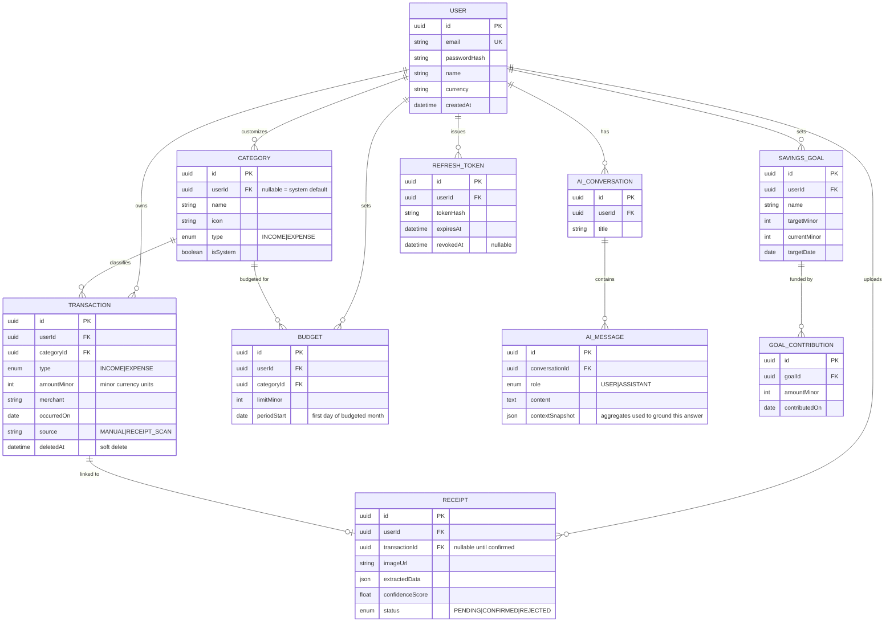

# Entity-Relationship Diagram

Full Prisma schema: [`apps/api/prisma/schema.prisma`](../apps/api/prisma/schema.prisma).

## Modeling decisions and why

**Unified `Transaction` table.** Income and expense share one table with a
`type` enum rather than two separate tables. This gives analytics one query
surface (no UNION-ing two tables for a trend chart) and one repository to
test. Category `type` is validated against transaction `type` at the
service layer so an "Groceries" category can never be attached to an
INCOME row.

**Money as `Int`, never `Float`/`Decimal` arithmetic in application code.**
All amounts are minor units (paise for INR, cents for USD). Every arithmetic
operation goes through the `Money` value object
(`apps/api/src/common/money/money.ts`), which throws on cross-currency
operations and rejects non-integer construction — rounding bugs are
structurally prevented, not just avoided by convention.

**Soft delete on `Transaction` (`deletedAt`), never a hard delete.**
Financial records should be recoverable/auditable. Every repository query
filters `deletedAt: null` by default so deleted rows are invisible without
being destroyed.

**`Receipt` is decoupled from `Transaction` until confirmed.** A `Receipt`
starts in `PENDING` with only `extractedData` (raw OCR output) populated.
`transactionId` stays null until the user reviews and confirms — modeling
the actual human-in-the-loop UX rather than assuming OCR output is correct.

**`AiMessage.contextSnapshot` stores the exact aggregated facts used to
generate that answer.** This is what makes AI Coach responses auditable:
you can always answer "why did it say that" by looking at the stored
snapshot, rather than trusting the model's numbers blindly.

**Refresh tokens are persisted (hashed), not just signed JWTs.** This lets
individual sessions be revoked (logout, or a detected compromise) without
needing a blanket secret rotation, and enables true rotation-on-refresh
(each refresh invalidates the previous token).
